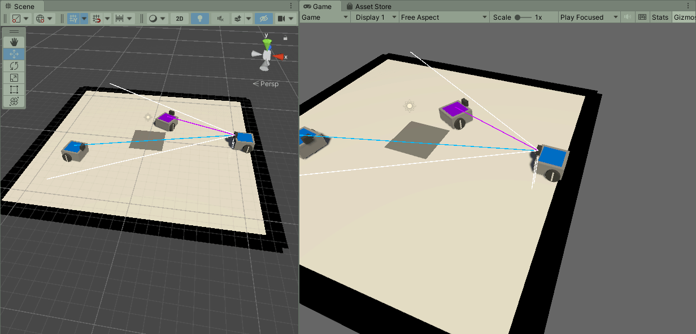

# Robot Tag Evolution in Unity

**Unity version:** 2021.3.13f1

Teaching robots to play tag in a Unity simulation using genetic algorithms to evolve the weights and biases in a neural network.

### Practical Information
- The successfuly transferred edge avoiding behavior was evolved in the "transferability" branch in the "EvolutionScene".
- The robot controller files written in Python are in the "robot_control_files.zip" file.

